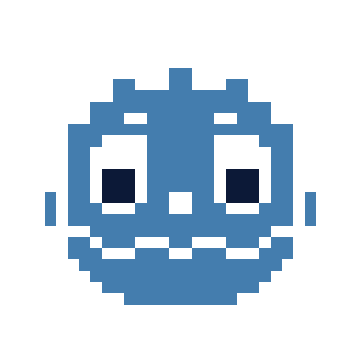
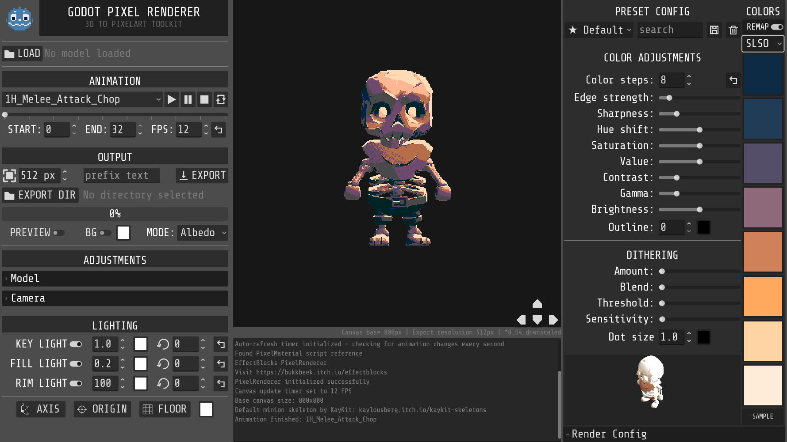

# Retro Forge

<div align="center">
  
</div>

**Retro Forge** is a 3D-to-pixel-art renderer for **Godot 4.5+**. It transforms 3D models and animations into retro-style pixel art with customizable effects, timeline-based animation control, and export options for frames or sprite sheets.


## 👨‍💻 Developer

Independently maintained for Godot 4.5+ users.

## 📥 Download

* **🆓 [GitHub Repository](https://github.com/uxerror/RetroForge)**: Free and open source

<div align="center">
  
</div>

## ✨ Core Features

### 🎨 Pixel Art Rendering

* Real-time 3D-to-pixel-art conversion (8–800 pixels)
* Color quantization with adjustable steps and palette support
* Shader effects: edge detection, sharpening, dithering, outlines
* Post-processing controls: HSV, contrast, gamma, brightness

### 🎬 Animation & Export

* Frame-by-frame animation export to PNG sequences
* Adjustable frame ranges, FPS, and resolution scaling
* Supports GLB/GLTF/FBX models with animation playback
* Texture import
* Orthographic camera with positioning, rotation, and preset views
* Checkpoint system:

  * Save and restore camera + model states
  * Automatic UI buttons for quick access to checkpoints
  * Export iterates through all checkpoints with unique filenames

### ⏱️ Timeline & Tracks

* Add unlimited tracks for animations
* Each track can store its own model and camera checkpoints
* Export iterates through all tracks and checkpoints
* Frames automatically receive unique filenames including track label and checkpoint index
* Optionally combine exports into a **sprite sheet**:

  * Width determined by the longest animation
  * Each animation placed on its own row

### 🎛️ Camera & Model Controls

* Fine-grained position and rotation adjustments with step values
* Camera presets (isometric, top-down, etc.)
* Model control buttons integrated into the render viewport
* Hideable render settings panels
* Simplified and refactored code for better defaults and maintainability

---

## 🚀 Quick Start

### Requirements

* **Godot Engine 4.5+ (beta)**
* OpenGL 3.3+ compatible GPU
* Minimum 4GB RAM (8GB recommended)

### Installation

1. Clone the repository:

   ```bash
   git clone https://github.com/uxerror/RetroForge.git
   cd RetroForge
   ```
2. Open the project in Godot 4.5+
3. Run the scene `RetroForge/PixelRenderer.tscn`

### Usage

1. **Load Model**: Select a GLB/GLTF/FBX file
2. **Adjust Effects**: Pixelation, colors, shaders
3. **Set Camera**: Position, rotation, and choose a preset view
4. **Save Checkpoint(s)**: Store model/camera states
5. **Export**: All checkpoints and tracks are exported with unique filenames or as a sprite sheet

---

## 📄 License

MIT License

---

## 📋 Changelog

### v1.4 (Current)

* Added **timeline system** with unlimited tracks
* Each track can contain its own checkpoints for models and cameras
* Export now iterates over all tracks and their checkpoints
* Frames are automatically named with prefix, track label, and checkpoint index
* Added **sprite sheet export**:

  * Width determined by the longest animation
  * Each animation occupies its own row
* Fully redesigned console system for logging

### v1.3 (Godot 4.5+ fork)

* Added **checkpoint system** for saving/restoring camera + model states
* Automatic UI buttons for each checkpoint
* Export supports multiple checkpoints with unique file naming
* Enhanced model and camera controls with step values
* Added camera presets
* UI improvements: movable model controls and hideable render panel
* Refactored code for better defaults and maintainability
* Compatible with Godot 4.5+ using `FoldableContainer`
